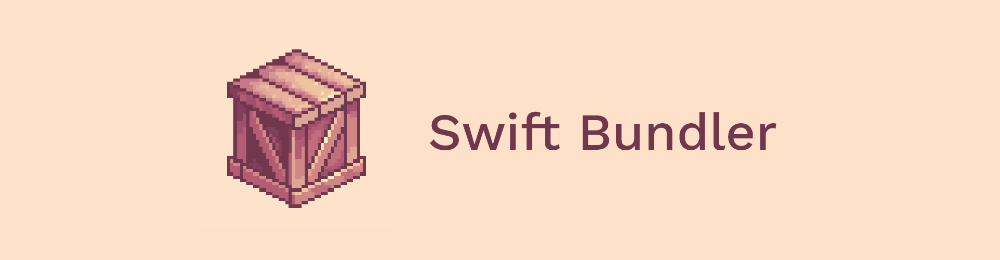

<p align="center">
  
</p>

<p align="center">
  <a href="https://swiftpackageindex.com/stackotter/swift-bundler"></a>
  <a href="https://swiftpackageindex.com/stackotter/swift-bundler"></a>
</p>

<br/>

A Swift Package Manager wrapper that allows the creation of macOS apps with Swift packages instead of Xcode projects. My motivation is that I think Xcode projects are a lot more restrictive than Swift packages, and Swift packages are less convoluted. My end goal is to be able to create Swift apps for Windows, Linux and MacOS with a single codebase.

## Installation

```sh
git clone https://github.com/stackotter/swift-bundler
cd swift-bundler
sh ./install.sh
```

## Usage

### Init

```sh
# Create a new swift package and set it up for bundling, by default the packge is created in a new directory with a name matching the package.
swift bundler init [name]
```

Currently it is not possible to automatically setup swift bundler for an existing package. However it is not too difficult to do manually. First make sure your package contains a `main.swift` file and make sure macOS platform version in `Package.swift` is at least 11.0 (earlier versions will likely work as well, but they are not tested). Then create a file called `Bundle.json` containing configuration in the format specified in the following section. You should now be good to go. If your `Package.swift` explicitly specifies an executable product, the name of the product must match the name of the package.

### Configuration

Running `swift bundler init` creates a `Bundle.json` file which contains all the configuration for the app. Below is an example configuration;

```json
{
  "target": "AppTargetName",
  "buildNumber" : 1,
  "bundleIdentifier" : "com.example.bundler-hello-world",
  "category" : "public.app-category.games",
  "minOSVersion" : "11.0",
  "versionString" : "0.1.0"
}
```

Remember to change this configuration to match your project.

### Xcode support

If you want to use xcode as your ide, run this in the package directory. Make sure you've run init first. This command only needs to be run once (or each time you clone if you gitignore the .swiftpm directory).

```sh
# Creates the files necessary to get xcode to run the package as an app
swift bundler generate-xcode-support
```

### Build

```sh
# Build the app and output the .app to the specified dir
# If no directory is specified the default output dir is .build/bundler
swift bundler build -o [dir]
```

### Build and run

```sh
# Builds and runs the app
swift bundler run
```

### Bundle

```sh
# Bundles an executable into a .app using config from the given package dir
swift bundler bundle -d [package dir] -e [executable file] -o [output dir]

# OR
# Converts the executable and bundles in a products dir into a .app
# If doing it this way and your app contains bundles, you may need to add the --dont-fix-bundles flag if the build was performed as a universal build or using xcode because both of those produce correct bundles
swift bundler bundle -d [package dir] -P [products dir] -o [output dir]
```

### Custom build scripts

Both prebuild and postbuild scripts are supported. Just create the `prebuild.sh` and/or `postbuild.sh` files in the root directory of your project and they will automatically be run with the next build. No extra configuration required.

### App Icons

There are two ways to add custom app icons to a bundle project.

1. The simplest way is to add an Icon1024x1024.png file in the root directory of your project and the bundler will automatically convert it to all the required sizes and create the AppIcon.icns in the app's resources. The png file must have an alpha channel and should be 1024x1024 but this isn't checked when building.
2. If you want to have different versions of your icon for different file sizes you can create a custom AppIcon.icns and add it to the root directory. You can even generate it from an IconSet in a custom prebuild script! (just see createIcns in Utils.swift for how this is done).

If both are present, `AppIcon.icns` is used.

### Info.plist customization

If you want to add extra key-value pairs to your apps Info.plist, you can add the following to `Bundle.json`:

```jsonc
{
  // ...
  "extraInfoPlistEntries": {
    "YourKey": "YourValue",
    "YourArrayKey": ["YourFirstArrayEntry"]
  }
}
```

If you provide a value for a key that is already present in the default Info.plist, the default value will be overidden with the value you provide.

### Help

If you want to see all available options just add `--help` to the end, (e.g. `swift bundler run --help`).

## Troubleshooting

If you are having an issue to do with bundle resources, try doing a universal build. Universal builds output correct bundles whereas for regular single architecture builds the bundler has to compile metal shaders and structure the bundles correctly. I don't know why only universal builds output correct bundles.
